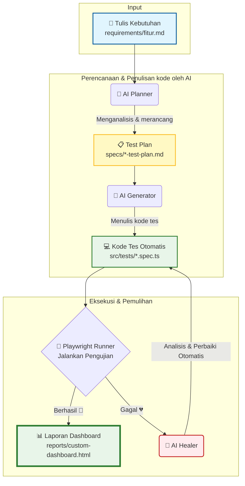

# 🚀 Playwright QA Kit

> **Framework Otomatisasi Pengujian Bertenaga AI**
> Solusi modern untuk merancang, menulis, menjalankan, memperbaiki, dan melaporkan pengujian otomatis (_End-to-End_) secara instan dengan bantuan kecerdasan buatan (AI).

---

## 🌟 Fitur Utama

Bagi tim QA (baik yang mahir coding maupun non-coder), framework ini dirancang untuk mempermudah pekerjaan sehari-hari:

- 🤖 **AI-Assisted Planning & Generation**: Cukup tulis apa yang ingin diuji dalam bahasa manusia biasa (dokumen kebutuhan/requirement), dan AI akan merancang skenario (_Test Plan_) serta menulis kode pengujiannya secara otomatis.
- 🩺 **Self-Healing (Perbaikan Otomatis)**: AI dapat menganalisis kegagalan dan memperbaiki selector.
- 📊 **Laporan Visual yang Cantik**: Menyediakan dashboard interaktif yang mudah dibaca oleh manajer, produk owner, maupun tim QA.
- 🌍 **Multi-Environment Ready**: Mudah mengalihkan target pengujian antara server **Lokal (Local)**, **Staging**, atau **Produksi (Production)** hanya dengan satu perintah mudah.

---

## 🔄 Bagaimana Ini Bekerja? (Alur Kerja AI)

Framework ini menggunakan siklus otomatisasi cerdas berikut untuk mengubah requirement mentah menjadi hasil pengujian yang siap saji:



---

## 📁 Struktur Folder yang Perlu Diketahui QA

**Tim QA: mulai dari [`docs/GUIDE.md`](docs/GUIDE.md) atau [`docs/README.md`](docs/README.md) (indeks semua dokumen).**

Berikut adalah folder penting yang akan sering Anda gunakan:

| Nama Folder / File             | Deskripsi                   | Kegunaan Bagi QA                                        |
| :----------------------------- | :-------------------------- | :------------------------------------------------------ |
| 📄 `docs/GUIDE.md`             | **Panduan QA utama**        | Setup lokal, pipeline, troubleshooting                  |
| 📁 `requirements/`             | File fitur + template       | Salin `_TEMPLATE.md` → `nama-fitur.md`                  |
| 📄 `requirements/_TEMPLATE.md` | Template requirement        | Format wajib untuk skenario baru                        |
| 📁 `specs/`                    | Test Plan (Dibuat oleh AI)  | Berisi skenario detail yang telah dikelompokkan oleh AI |
| 📁 `src/tests/`                | Kode Pengujian Otomatis     | Folder tempat kode pengujian `.spec.ts` disimpan        |
| 📁 `reports/`                  | Hasil Pengujian & Dashboard | Folder untuk melihat laporan kesuksesan tes             |
| 📁 `environments/`             | Konfigurasi URL & Akun      | Tempat mengatur akun login/URL per environment          |
| 📄 `CUSTOM-MCP.md`             | Kontrak tool MCP            | Referensi teknis (maintainer framework)                 |

---

## 🛠️ Panduan Memulai Cepat (Quick Start)

### 1. Persiapan Sistem (Sekali Saja)

Pastikan komputer Anda sudah terinstal **Node.js** (versi **>= 20.19.0**, LTS 20.x recommended) dan **Git**.

### 2. Clone Repository

```bash
git clone https://github.com/k-ardliyan/playwright-qa-kit.git
cd playwright-qa-kit
```

### 3. Instalasi Framework

Di dalam folder repo, jalankan:

```bash
# Menginstal semua pustaka & dependensi yang diperlukan
npm install

# Mengunduh browser otomatis (Chromium) yang dibutuhkan untuk tes
npx playwright install --with-deps chromium

# Build MCP server custom (wajib sebelum Codex Agent)
npm run mcp:build
```

### 4. Konfigurasi Lingkungan (Credentials)

Buat file pengaturan untuk target pengujian Anda di folder `environments/`. Contoh:

- Duplikat file `environments/local.env.example` dan ubah namanya menjadi `environments/local.env`.
- Buka file tersebut dan masukkan URL aplikasi serta detail login uji coba Anda.

---

## 🏃‍♂️ Cara Menjalankan Pengujian

Anda dapat menjalankan pengujian dengan berbagai mode berikut melalui terminal:

```bash
# 1. Menjalankan Semua Pengujian (tanpa demo Healer)
npm test

# 2. Iterasi cepat (tanpa setup:check berat)
npm run test:fast

# 3. Smoke Test saja
npm run test:smoke

# 4. Demo Healer (sengaja gagal — latihan)
npm run test:demo

# 5. Headed / UI mode
npm run test:headed
npm run test:ui
```

---

## 📈 Laporan Hasil Pengujian

Setelah pengujian selesai, Anda dapat melihat hasilnya dengan mudah:

1.  **Dashboard Kustom**: Klik dua kali file `reports/custom-dashboard.html` di komputer Anda untuk membukanya di browser. Tampilan ini sangat ramah untuk non-coder karena menampilkan ringkasan kelulusan secara visual.
2.  **Laporan Resmi Playwright**: Jalankan perintah berikut untuk membuka laporan lengkap bawaan Playwright yang berisi rekaman per langkah:
    ```bash
    npx playwright show-report
    ```

---

## 🤖 Menggunakan Kekuatan AI untuk Menulis Tes (QA Mode)

### Tiga server MCP (wajib untuk Agent)

| Server            | Fungsi                                                 |
| :---------------- | :----------------------------------------------------- |
| `playwright`      | Eksplorasi UI (`browser_navigate`, `browser_snapshot`) |
| `playwright-test` | Menjalankan tes (`run_tests`)                          |
| `playwright-qa`   | Requirement, validasi, baca kegagalan & ringkasan      |

Pastikan MCP aktif di Cursor/VS Code dan jalankan sekali:

```bash
npm run mcp:build
```

Detail tool: [CUSTOM-MCP.md](CUSTOM-MCP.md).

### Alur QA dengan AI

#### Menulis requirement (bisa di luar Cursor)

1. Salin template [`requirements/_TEMPLATE.md`](requirements/_TEMPLATE.md).
2. (Opsional) Rapikan catatan kasar dengan ChatGPT/Gemini — lihat section "Prompt untuk AI eksternal" di [`docs/writing-requirements.md`](docs/writing-requirements.md#prompt-untuk-ai-eksternal-chatgpt--gemini).
3. Simpan sebagai `requirements/nama-fitur.md` — lihat contoh [`requirements/example-login-extension.md`](requirements/example-login-extension.md).

#### Menjalankan pipeline di Cursor

4. Minta bantuan AI (Agent mode), contoh:
   > _"Validasi requirements/example-login-extension.md, lalu jalankan pipeline: plan, generate, validate, run_tests, heal jika gagal, report."_
5. AI memvalidasi dokumen (`validate_requirement`), membuat `specs/*-test-plan.md`, kode di `src/tests/`, menjalankan tes lewat **playwright-test**, dan memperbaiki kegagalan lewat **playwright-qa** `get_test_failures`.

Panduan lengkap: [`docs/GUIDE.md`](docs/GUIDE.md) · lihat section `Prompt Siap Pakai` untuk contoh prompt Agent.

### Checklist integrasi MCP

- [ ] Tiga server MCP hijau di IDE
- [ ] `npm run mcp:build` sukses
- [ ] `health_check` → `status: success`
- [ ] `validate_requirement` → `status: success` untuk file requirement Anda
- [ ] Setelah `npm test`, ada `test-results/results.json`
- [ ] `get_test_failures` mengembalikan data terstruktur
- [ ] `get_test_summary` membaca `reports/test-summary.json`

---

## 📋 Standard Pengujian (Quality Gates)

**PR / pre-push (tanpa app live):**

```bash
npm run test:quality
```

Mencakup: format, lint, typecheck, validate specs, validate requirement example, property tests, MCP build, health check.

**Perintah individual:**

- `npm run lint` — ESLint
- `npm run typecheck` — TypeScript
- `npm run format:check` — Prettier
- `npm run validate` — struktur tes (`test.describe`, `test.step`, traceability)
- `npm run validate:requirement -- requirements/nama-fitur.md` — format requirement
- `npm run test:property` — property-based contract tests
- `npm run health:check` — pre-flight (CLI `health_check`)

**CI:**

| Workflow      | Trigger            | Butuh secrets                  |
| ------------- | ------------------ | ------------------------------ |
| `quality.yml` | PR + push          | Tidak                          |
| `e2e.yml`     | push main + manual | Ya (`BASE_URL` + 4 kredensial) |

Folder `example/erpku/` adalah **reference adapter** ERPKU — dijalankan CI E2E (`npm run test:erpku-example`) bila secrets tersedia. Template core (`npm test`) hanya menjalankan seed + demo di `src/tests/`.

---

## 📚 Dokumen Pendukung Lainnya

Lihat [docs/README.md](docs/README.md) untuk indeks lengkap dokumentasi QA dan maintainer.

Dokumen yang paling sering dibuka QA:

- 📄 [docs/GUIDE.md](docs/GUIDE.md) — Panduan utama (setup, pipeline, troubleshooting)
- 📄 [docs/writing-requirements.md](docs/writing-requirements.md) — Format requirement + prompt AI eksternal
- 📄 [docs/prompt-ai-agent.md](docs/prompt-ai-agent.md) — Prompt Codex / Cursor Agent
- 📄 [docs/FORK-ONBOARDING.md](docs/FORK-ONBOARDING.md) — Fork template + integrasi repo existing
- 📄 [CUSTOM-MCP.md](CUSTOM-MCP.md) — Kontrak tool MCP (maintainer)
