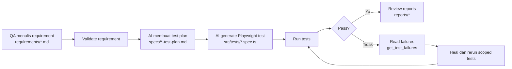
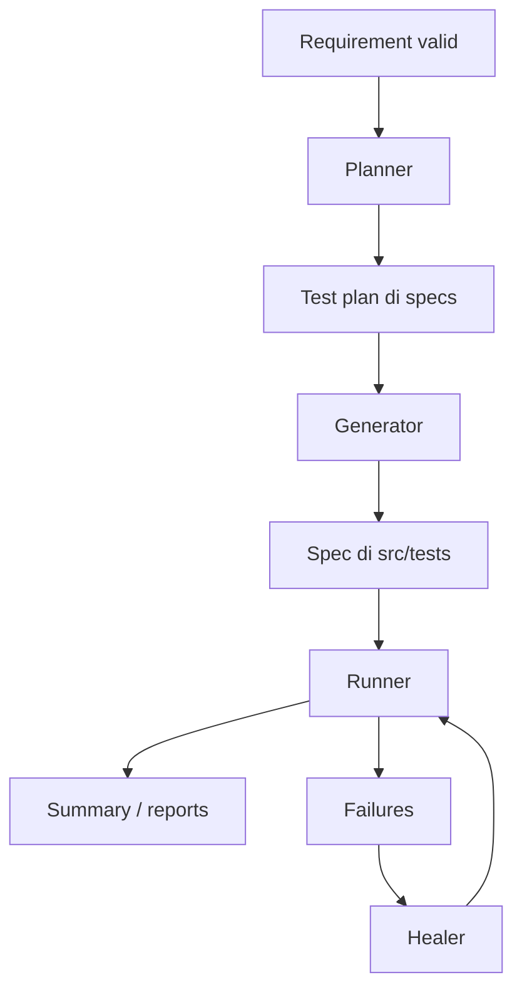

# 🚀 Playwright QA Kit

     

> **AI-assisted Playwright framework untuk tim QA yang ingin bergerak dari requirement → test plan → automated test → report dengan lebih cepat, lebih rapi, dan lebih mudah dibaca.**
>
> Repo ini dirancang agar QA tidak perlu mulai dari kode. Anda mulai dari **kebutuhan pengujian**, lalu AI dan framework membantu mengubahnya menjadi **scenario**, **Playwright test**, **healing flow**, dan **laporan hasil uji**.
>
> **Status singkat:** requirement-first • QA-friendly • MCP-ready • report-driven • heal-ready

---

## Kenapa Repo Ini Penting untuk QA?

Framework ini membantu QA fokus pada hal yang paling bernilai:

- **apa yang harus diuji**,
- **hasil yang diharapkan**,
- **risiko bisnis**,
- **cakupan scenario**,
- bukan tersesat dulu di locator dan boilerplate code.

Yang Anda dapatkan:

- requirement-first workflow,
- AI-assisted planning dan generation,
- Playwright execution yang siap pakai,
- failure analysis + healing flow,
- report visual yang enak dibaca QA dan stakeholder.

**Cocok untuk:**

- QA non-code / semi-code,
- QA automation,
- lead QA / test architect,
- PM / BA / stakeholder yang ingin membaca hasil test dengan cepat.

---

## Mulai di Sini dalam 5 Menit

Kalau Anda baru pertama kali buka repo ini, lakukan ini dulu:

1. Install dependency:
   ```bash
   npm install
   npx playwright install --with-deps chromium
   npm run mcp:build
   ```
2. Siapkan environment:
   - salin `environments/local.env.example` → `environments/local.env`
   - isi `BASE_URL` dan akun test
3. Verifikasi setup:
   ```bash
   npm run setup:check
   npm run health:check
   ```
4. Buka panduan utama QA:
   - [docs/GUIDE.md](docs/GUIDE.md)
5. Mulai dari contoh requirement:
   - [requirements/example-login-extension.md](requirements/example-login-extension.md)

**Target sukses pertama:**

- setup sehat,
- requirement bisa divalidasi,
- test bisa dijalankan,
- report bisa dibuka.

---

## Daftar Isi

### Overview

- [Apa Itu Framework Ini?](#apa-itu-framework-ini)
- [Siapa yang Harus Memakai Ini?](#siapa-yang-harus-memakai-ini)
- [Workflow QA dalam Satu Gambar](#workflow-qa-dalam-satu-gambar)

### Start Here

- [Quick Start QA](#quick-start-qa)
- [Perbedaan Template Core vs ERPKU Reference Adapter](#perbedaan-template-core-vs-erpku-reference-adapter)
- [Artefak: Mana yang Ditulis QA dan Mana yang Dihasilkan AI](#artefak-mana-yang-ditulis-qa-dan-mana-yang-dihasilkan-ai)

### Daily Use

- [Command yang Paling Sering Dipakai QA](#command-yang-paling-sering-dipakai-qa)
- [Cara Membaca Hasil Test](#cara-membaca-hasil-test)
- [Checklist Harian QA](#checklist-harian-qa)

### Learn the System

- [Mapping STLC ke Struktur Repo](#mapping-stlc-ke-struktur-repo)
- [Struktur Folder yang Wajib Dipahami QA](#struktur-folder-yang-wajib-dipahami-qa)
- [Mode AI dan MCP untuk QA](#mode-ai-dan-mcp-untuk-qa)

### Docs & Verification

- [Peta Dokumentasi: Buka File yang Mana?](#peta-dokumentasi-buka-file-yang-mana)
- [Quality Gates dan Verifikasi](#quality-gates-dan-verifikasi)
- [FAQ untuk QA](#faq-untuk-qa)

---

## Apa Itu Framework Ini?

Framework ini adalah **Playwright QA framework dengan bantuan AI** untuk mempercepat proses end-to-end berikut:

1. QA menulis **requirement**,
2. AI menyusun **test plan**,
3. AI menghasilkan **Playwright test**,
4. runner menjalankan test,
5. failure dibaca dan bisa di-**heal**,
6. hasilnya tampil dalam **report** yang bisa dibaca cepat.

Framework ini bukan sekadar kumpulan script. Ini adalah **alur kerja QA** yang sengaja dibentuk supaya requirement, planning, execution, healing, dan reporting saling terhubung.

---

## Siapa yang Harus Memakai Ini?

### 1. QA non-code / semi-code

Gunakan repo ini bila Anda ingin fokus menulis requirement dan scenario, lalu minta agent membantu generate dan heal.

### 2. QA automation

Gunakan repo ini bila Anda ingin mempercepat penulisan test Playwright tanpa kehilangan struktur dan traceability.

### 3. Maintainer / integrator

Gunakan repo ini bila Anda ingin menjadikan framework ini template untuk project lain melalui flow adapter / fork.

---

## Workflow QA dalam Satu Gambar



**Makna flow ini:**

- QA mulai dari **requirement**,
- bukan dari `.spec.ts`.
- AI membantu memecah requirement menjadi plan lalu code.
- Jika gagal, framework mendukung alur **failure → heal → rerun**.

---

## Quick Start QA

### 1. Clone repo

```bash
git clone https://github.com/k-ardliyan/playwright-qa-kit.git
cd playwright-qa-kit
```

### 2. Install

```bash
npm install
npx playwright install --with-deps chromium
npm run mcp:build
```

### 3. Setup environment

- salin `environments/local.env.example` menjadi `environments/local.env`
- isi `BASE_URL` dan kredensial test
- pastikan project MCP config tersedia di `.mcp.json` (root repo); `.vscode/mcp.json` hanya untuk kompatibilitas editor bila perlu

### 4. Verifikasi setup

```bash
npm run setup:check
npm run health:check
```

### 5. Validasi requirement contoh

```bash
npm run validate:requirement -- requirements/example-login-extension.md
```

### 6. Jalankan test utama

```bash
npm test
```

### 7. Buka hasilnya

- [reports/custom-dashboard.html](reports/custom-dashboard.html)
- atau:
  ```bash
  npx playwright show-report
  ```

Untuk panduan operasional lengkap, lanjut ke:

- [docs/GUIDE.md](docs/GUIDE.md)

---

## Perbedaan Template Core vs ERPKU Reference Adapter

Repo ini punya dua konteks penting:

| Jalur                       | Fungsi                            | Kapan dipakai                                               |
| --------------------------- | --------------------------------- | ----------------------------------------------------------- |
| **Template Core**           | Flow utama framework              | Saat Anda ingin memakai kerangka umum repo ini              |
| **ERPKU Reference Adapter** | Contoh implementasi adapter nyata | Saat Anda ingin melihat contoh project-specific integration |

### Template Core

- konfigurasi default,
- generated test masuk ke [src/tests/](src/tests/),
- cocok untuk onboarding dan flow generik.

### ERPKU Reference Adapter

- contoh adapter nyata di [example/erpku/](example/erpku/),
- berguna untuk referensi implementasi,
- tidak menjadi target default generator.

Detail operasionalnya ada di:

- [docs/GUIDE.md](docs/GUIDE.md)
- [docs/FORK-ONBOARDING.md](docs/FORK-ONBOARDING.md)

---

## Artefak: Mana yang Ditulis QA dan Mana yang Dihasilkan AI

| Artefak                         | Dibuat oleh             | Fungsi              | Aksi QA                      |
| ------------------------------- | ----------------------- | ------------------- | ---------------------------- |
| `requirements/*.md`             | QA                      | Kebutuhan pengujian | Tulis / review               |
| `specs/*-test-plan.md`          | AI Planner              | Test plan detail    | Review scenario              |
| `src/tests/*.spec.ts`           | AI Generator / engineer | Script Playwright   | Jalankan / review bila perlu |
| `reports/custom-dashboard.html` | Runner / reporter       | Dashboard hasil     | Baca status test             |
| `reports/test-summary.json`     | Reporter                | Summary terstruktur | Dipakai tooling / agent      |

### Kenapa foldernya `requirements/`, bukan `skenario/`?

Karena file di sana adalah **input awal**. Satu requirement bisa menghasilkan banyak scenario. Scenario hasil AI baru muncul di [specs/](specs/).

---

## Command yang Paling Sering Dipakai QA

Gunakan command ini sebagai paket inti QA:

```bash
# Verifikasi setup lokal
npm run setup:check
npm run health:check

# Validasi requirement
npm run validate:requirement -- requirements/nama-fitur.md

# Jalankan test utama
npm test

# Jalankan smoke test
npm run test:smoke

# Jalankan browser terlihat
npm run test:headed

# Jalankan quality gate lengkap
npm run test:quality
```

### Kapan dipakai?

| Command                               | Kegunaan                                      |
| ------------------------------------- | --------------------------------------------- |
| `npm run setup:check`                 | memastikan setup dasar siap                   |
| `npm run health:check`                | memastikan pre-flight sehat                   |
| `npm run validate:requirement -- ...` | memastikan requirement valid sebelum pipeline |
| `npm test`                            | menjalankan suite utama                       |
| `npm run test:smoke`                  | verifikasi alur paling penting                |
| `npm run test:headed`                 | debug dengan browser terlihat                 |
| `npm run test:quality`                | gate lengkap sebelum push / PR                |

Perintah lanjutan tetap ada di:

- [docs/GUIDE.md](docs/GUIDE.md)

---

## Cara Membaca Hasil Test

### 1. Dashboard QA-friendly

File:

- [reports/custom-dashboard.html](reports/custom-dashboard.html)

Cocok untuk:

- ringkasan pass/fail,
- baca cepat oleh QA,
- review singkat ke stakeholder.

### 2. Report Playwright detail

Jalankan:

```bash
npx playwright show-report
```

Cocok untuk:

- lihat step detail,
- trace,
- screenshot,
- attachment,
- investigasi failure teknis.

### 3. Artifacts untuk debugging

Folder umum:

- `reports/`
- `test-results/`

### 4. Summary terstruktur

File:

- [reports/test-summary.json](reports/test-summary.json)

Digunakan oleh tooling/agent untuk membaca total pass/fail/skipped.

---

## Checklist Harian QA

### Sebelum mulai

- [ ] environment target benar
- [ ] `npm run mcp:build` sukses
- [ ] MCP server aktif di IDE
- [ ] `npm run health:check` sehat

### Saat menulis requirement

- [ ] pakai [requirements/\_TEMPLATE.md](requirements/_TEMPLATE.md)
- [ ] judul pakai format `# REQ-XXX: Nama Fitur`
- [ ] `## Metadata` terisi
- [ ] `## Kriteria Penerimaan` terisi
- [ ] setiap scenario punya `**Langkah:**` dan `**Hasil:**`

### Sebelum minta agent generate

- [ ] `npm run validate:requirement -- requirements/nama-fitur.md` lulus

### Setelah run test

- [ ] failure bisa dibaca dari JSON hasil run aktif
- [ ] dashboard report terbentuk
- [ ] summary report terbentuk

---

## Mapping STLC ke Struktur Repo

| Tahap STLC                | Arti                      | Artefak Repo                         |
| ------------------------- | ------------------------- | ------------------------------------ |
| Requirement Analysis      | menentukan apa yang diuji | [requirements/](requirements/)       |
| Test Design               | menyusun scenario / plan  | [specs/](specs/)                     |
| Test Implementation       | menulis script test       | [src/tests/](src/tests/)             |
| Test Execution            | menjalankan test          | `npm test`, Playwright, MCP          |
| Defect / Failure Analysis | membaca kegagalan         | `get_test_failures`, `test-results/` |
| Test Reporting            | membaca hasil akhir       | [reports/](reports/)                 |

Ini penting supaya QA paham repo ini mengikuti flow kerja testing yang natural, bukan sekadar kumpulan file otomatisasi.

---

## Struktur Folder yang Wajib Dipahami QA

| Folder / File                                                                      | Fungsi                    | Peran untuk QA                    |
| ---------------------------------------------------------------------------------- | ------------------------- | --------------------------------- |
| [docs/GUIDE.md](docs/GUIDE.md)                                                     | panduan QA utama          | dokumen pertama yang wajib dibaca |
| [docs/README.md](docs/README.md)                                                   | indeks dokumen            | navigasi semua docs               |
| [requirements/](requirements/)                                                     | input kebutuhan pengujian | tempat QA menulis requirement     |
| [requirements/\_TEMPLATE.md](requirements/_TEMPLATE.md)                            | template requirement      | format standar                    |
| [requirements/example-login-extension.md](requirements/example-login-extension.md) | contoh valid              | referensi requirement             |
| [specs/](specs/)                                                                   | output plan               | hasil planner                     |
| [src/tests/](src/tests/)                                                           | output test               | hasil generator / test executable |
| [reports/](reports/)                                                               | output report             | hasil yang dibaca QA              |
| [environments/](environments/)                                                     | konfigurasi env           | URL dan kredensial                |
| [CUSTOM-MCP.md](CUSTOM-MCP.md)                                                     | kontrak tool MCP          | referensi teknis                  |
| [AGENTS.md](AGENTS.md)                                                             | kontrak pipeline agent    | source of truth orkestrasi        |

---

## Mode AI dan MCP untuk QA

Framework ini mendukung agent lewat 3 server MCP:

| Server            | Fungsi                                             |
| ----------------- | -------------------------------------------------- |
| `playwright`      | browser interaction / eksplorasi UI                |
| `playwright-test` | menjalankan test                                   |
| `playwright-qa`   | requirement parsing, validation, failures, summary |

### Alur agent secara ringkas



Contoh prompt aman untuk QA:

> Jalankan pipeline lengkap untuk `requirements/login-user.md` sesuai kontrak `AGENTS.md`: validasi requirement, buat test plan, generate test, validate generated tests, run, heal jika gagal, lalu return summary dan unresolved failures.

Detail penuh tetap ada di:

- [docs/GUIDE.md](docs/GUIDE.md)
- [CUSTOM-MCP.md](CUSTOM-MCP.md)
- [AGENTS.md](AGENTS.md)

---

## Peta Dokumentasi: Buka File yang Mana?

| Kalau Anda ingin...                   | Buka ini                                                     |
| ------------------------------------- | ------------------------------------------------------------ |
| setup QA pertama kali                 | [docs/GUIDE.md](docs/GUIDE.md)                               |
| menulis requirement yang valid        | [docs/writing-requirements.md](docs/writing-requirements.md) |
| melihat indeks semua dokumen          | [docs/README.md](docs/README.md)                             |
| fork / adapt repo ini ke project lain | [docs/FORK-ONBOARDING.md](docs/FORK-ONBOARDING.md)           |
| memahami tool MCP dan kontraknya      | [CUSTOM-MCP.md](CUSTOM-MCP.md)                               |
| memahami alur agent resmi             | [AGENTS.md](AGENTS.md)                                       |

---

## Quality Gates dan Verifikasi

### Gate lengkap sebelum push / PR

```bash
npm run test:quality
```

Gate ini mencakup:

- format,
- lint,
- typecheck,
- validate generated tests,
- validate requirement,
- property tests,
- MCP build,
- health check.

### Verifikasi dasar yang harus lulus

```bash
npm run setup:check
npm run health:check
npm run validate:requirement -- requirements/nama-fitur.md
npm test
```

Kalau empat hal ini sehat, biasanya QA sudah punya fondasi yang cukup untuk lanjut ke pipeline AI.

---

## FAQ untuk QA

### Kenapa `requirements/`, bukan `skenario/`?

Karena `requirements/` berisi **input awal**. Satu requirement bisa dipecah menjadi banyak scenario. Scenario hasil AI baru muncul di [specs/](specs/).

### Apa beda `requirements/`, `specs/`, dan `src/tests/`?

- `requirements/` = apa yang ingin diuji
- `specs/` = plan / skenario hasil AI
- `src/tests/` = script Playwright yang bisa dijalankan

### Kalau saya non-code, apa saya wajib edit `.spec.ts`?

Tidak wajib. Flow idealnya: QA fokus menulis requirement dan review hasil, sedangkan agent membantu generate dan heal.

### Kalau test gagal, saya lihat apa dulu?

Urutan aman:

1. [reports/custom-dashboard.html](reports/custom-dashboard.html)
2. `npx playwright show-report`
3. failure flow lewat `get_test_failures` / healer

### Dokumen pertama yang harus dibaca QA apa?

Mulai dari:

- [docs/GUIDE.md](docs/GUIDE.md)

---

## Penutup

Kalau Anda ingin memakai repo ini dengan benar sebagai QA, ingat 5 langkah utama:

1. Tulis requirement yang jelas.
2. Validasi requirement.
3. Minta agent jalankan pipeline.
4. Review output plan, test, dan report.
5. Ulangi sampai scenario stabil.

Untuk panduan operasional langkah demi langkah, buka [docs/GUIDE.md](docs/GUIDE.md).
