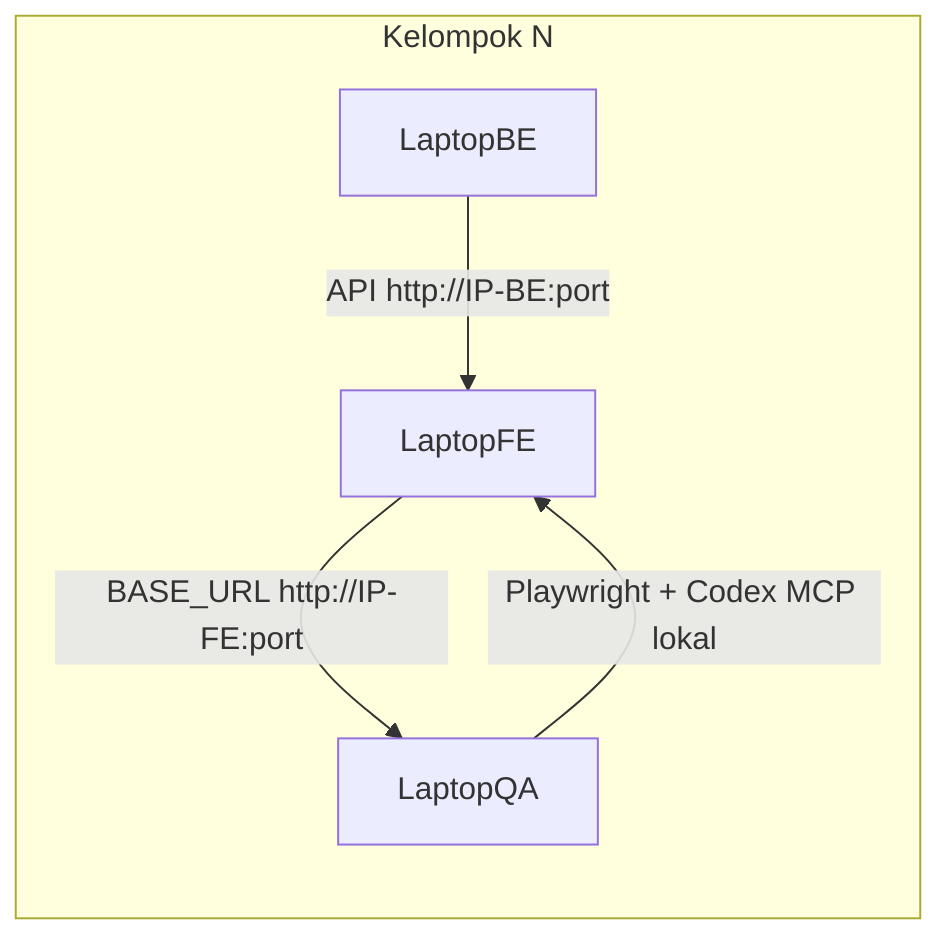

# Workshop Alpha — v0.1.0-alpha.1

Checklist Go/No-Go hari-H dan script sesi workshop.

- [GUIDE.md](GUIDE.md) — setup MCP detail
- [ALPHA-LIMITATIONS.md](ALPHA-LIMITATIONS.md) — batasan alpha

Target Path A per peserta: 1 requirement valid, 1 spec jalan, dashboard `reports/custom-dashboard.html` terbuka.

---

## Profil workshop (referensi)

Contoh cohort multi-kelompok — sesuaikan jumlah pod:

- Path A hands-on: Plan → Generate → Run → Heal (best-effort)
- Multi-pod LAN: BE + FE per meja; QA pakai IP FE (bukan `localhost` di laptop QA)
- VS Code + Codex; 3 MCP lokal per laptop (tidak rebutan antar meja)
- Hari-H: latihan [`example-login-extension.md`](../requirements/example-login-extension.md); fitur inventory = homework
- Facilitator solo — eskalasi: [Protokol eskalasi](#protokol-eskalasi)

---

<a id="topologi-lan"></a>

## Topologi LAN

Setiap kelompok: laptop BE ↔ laptop FE ↔ laptop QA (satu subnet WiFi/LAN).



<a id="template-ip-kelompok"></a>

### Template IP per kelompok (facilitator isi hari-H)

| Kelompok | IP FE | Port | IP BE (opsional) | Catatan |
| -------- | ----- | ---- | ---------------- | ------- |
| 1        |       |      |                  |         |
| 2        |       |      |                  |         |
| 3        |       |      |                  |         |
| 4        |       |      |                  |         |
| 5        |       |      |                  |         |

### Template `environments/local.env` (laptop QA)

Salin dari [`environments/local.env.example`](../environments/local.env.example), lalu isi IP FE meja:

```env
BASE_URL=http://<IP-FE-MEJA>:<port>/
APP_ENV=local
ENV_NAME=workshop-pod-N
PLAYWRIGHT_CONFIG=playwright.config.ts
TEST_USER_EMAIL=...
TEST_USER_PASSWORD=...
```

Setelah ubah `local.env` → **restart MCP servers** di VS Code. Detail: [ALPHA-LIMITATIONS.md](ALPHA-LIMITATIONS.md).

---

<a id="go-no-go"></a>

## Go/No-Go

Semua item dicek serentak di hari-H sebelum latihan pipeline. Facilitator: mulai dari Kategori 1. Instalasi detail → [Setup lokal di GUIDE](GUIDE.md#setup-lokal).

**Repo:** [https://github.com/k-ardliyan/playwright-qa-kit](https://github.com/k-ardliyan/playwright-qa-kit) · branch **`main`** (alpha `v0.1.0-alpha.1`)

### Kategori 1 — Facilitator & plenary

- [ ] Branch `main` terbaru tersedia di GitHub; peserta clone dari URL di atas (tanpa checkout tag)
- [ ] `npm run test:quality` hijau di mesin facilitator
- [ ] [Bundel handout](#bundel-handout) dibagikan (link doc + prompt Codex)
- [ ] Tabel [IP per kelompok](#template-ip-kelompok) terisi; kredensial QA per meja dibagikan
- [ ] Framing alpha dibacakan ([Opening facilitator](#opening-facilitator))
- [ ] **Path A** untuk latihan pipeline; **Path B** hanya demo adapter — lihat [Framework core vs adapter](GUIDE.md#framework-core-vs-adapter)

### Kategori 2 — Pod: jaringan & aplikasi (BE/FE, per kelompok)

- [ ] Semua laptop (BE, FE, QA) **satu subnet WiFi/LAN**
- [ ] FE dev server listen **`0.0.0.0`**, bukan hanya `127.0.0.1`
- [ ] Env FE: API/base URL → **IP laptop BE**, bukan `localhost` di sisi FE
- [ ] BE reachable dari laptop FE (`curl` dari FE ke API)
- [ ] Firewall: port FE (dan BE jika perlu) allow dari subnet LAN
- [ ] Fitur kelompok bisa dibuka **manual di browser dari laptop QA**

### Kategori 3 — Pod: laptop QA — prasyarat

- [ ] Node.js **>= 22.22.1** (`node -v`)
- [ ] Git terinstall
- [ ] VS Code + ekstensi **Codex** terinstall

### Kategori 4 — Pod: laptop QA — repo & dependensi

Jalankan di folder project di **setiap laptop QA**:

```bash
git clone https://github.com/k-ardliyan/playwright-qa-kit.git
cd playwright-qa-kit
npm install
npx playwright install --with-deps chromium
npm run mcp:build
```

- [ ] Clone `main` selesai tanpa error
- [ ] `npm run mcp:build` sukses

### Kategori 5 — Pod: laptop QA — environment & MCP

- [ ] `environments/local.env` dibuat dari [`local.env.example`](../environments/local.env.example)
- [ ] `BASE_URL=http://<IP-FE-MEJA>:<port>/` (IP FE meja sendiri — **bukan** `localhost` di laptop QA)
- [ ] Kredensial QA (`TEST_USER_*`) terisi
- [ ] `PLAYWRIGHT_CONFIG=playwright.config.ts`
- [ ] Setelah ubah `local.env` → **restart MCP servers** di VS Code
- [ ] [`.vscode/mcp.json`](../.vscode/mcp.json) — **3 server MCP hijau** di Codex

### Kategori 6 — Pod: laptop QA — verifikasi

```bash
npm run health:check
npm test
```

- [ ] `npm run health:check` → tanpa status `fail`
- [ ] `npm test` lulus (seed core)
- [ ] Browser di laptop QA membuka `BASE_URL` — halaman app tampil
- [ ] (Opsional gate) Facilitator lihat screenshot MCP + output `health:check` per meja

### Keputusan GO / NO-GO

| Status    | Kondisi                                                                                      |
| --------- | -------------------------------------------------------------------------------------------- |
| **GO**    | Semua checkbox Kategori 1–6 lulus untuk **setiap kelompok** yang ikut latihan pipeline       |
| **NO-GO** | MCP merah massal; FE unreachable dari laptop QA; `health:check` fail setelah troubleshooting |

Jika **NO-GO** di satu meja: meja itu lanjut observe/demo; jangan blok plenary seluruh ruangan. Lihat [Protokol eskalasi](#protokol-eskalasi).

---

<a id="protokol-eskalasi"></a>

## Protokol eskalasi

Sebelum ping facilitator, selesaikan di meja:

1. **QA + Codex Agent** — ikuti [Troubleshooting health_check di GUIDE](GUIDE.md#troubleshooting-health-check)
2. **FE/BE meja** — perbaiki network, env FE, bug app, firewall
3. **Facilitator** — eskalasi terakhir; sertakan output `npm run health:check` + screenshot error

---

## Peserta — checklist singkat

| #   | Path A (pipeline)                                         | Path B (adapter demo)                                                                   |
| --- | --------------------------------------------------------- | --------------------------------------------------------------------------------------- |
| 1   | Install + `local.env` + `npm run health:check`            | Sama                                                                                    |
| 2   | MCP connected; restart setelah ubah env                   | Sama                                                                                    |
| 3   | Sanity: `npm test`                                        | Set adapter config + `AUTH_*` → sanity: `npm run test:erpku-example -- --project=smoke` |
| 4   | Tulis requirement (`_TEMPLATE.md` → `<fitur>.md`)         | Opsional: baca spec di `example/erpku/tests/`                                           |
| 5   | `npm run validate:requirement -- requirements/<fitur>.md` | —                                                                                       |
| 6   | Pipeline AI → [prompt-ai-agent.md](prompt-ai-agent.md)    | — (tidak generate ke adapter folder)                                                    |
| 7   | `reports/custom-dashboard.html`                           | Lihat laporan dari smoke run                                                            |

**Latihan pipeline (Path A):** [`requirements/example-login-extension.md`](../requirements/example-login-extension.md) — generate selalu ke `src/tests/`.

---

## Timeline

### Path A — format generik / single pod (~120 menit)

| Menit   | Aktivitas                                 |
| ------- | ----------------------------------------- |
| 0–30    | Setup ([GUIDE.md](GUIDE.md)) + `npm test` |
| 30–35   | MCP connected                             |
| 35–55   | Tulis + validasi requirement              |
| 55–90   | Pipeline AI (Plan → Generate → Run)       |
| 90–105  | Jalankan tes + dashboard                  |
| 105–120 | Feedback + Q&A                            |

### Multi-pod LAN (~180 menit)

Untuk cohort beberapa kelompok (BE/FE/QA per meja), facilitator solo + Agent paralel per meja:

| Menit   | Aktivitas                                                                                                               |
| ------- | ----------------------------------------------------------------------------------------------------------------------- |
| 0–45    | Plenary + [Go/No-Go](#go-no-go) serentak (Kategori 1–6); framing alpha ([ALPHA-LIMITATIONS.md](ALPHA-LIMITATIONS.md))   |
| 45–60   | Rotasi facilitator — meja yang belum centang Kategori 6                                                                 |
| 60–75   | Demo live Path A **1 meja** (~15 menit); meja lain observe                                                              |
| 75–105  | **Paralel:** pipeline [`example-login-extension.md`](../requirements/example-login-extension.md) per meja (Codex Agent) |
| 105–120 | Dashboard + debrief success criteria                                                                                    |
| 120–180 | Draft requirement fitur inventory + **homework** mandiri ([`_TEMPLATE.md`](../requirements/_TEMPLATE.md))               |

Meja idle (pre-flight / demo): tulis skenario requirement tanpa Agent. Kelompok 2 QA: satu **driver**, satu observer.

### Path B (~60 menit, tanpa pipeline AI)

| Menit | Aktivitas                                           |
| ----- | --------------------------------------------------- |
| 0–30  | Setup + adapter env + smoke run                     |
| 30–50 | Walkthrough `example/erpku/` (POM, fixtures, specs) |
| 50–60 | Feedback + Q&A                                      |

---

## Fallback tanpa MCP

```bash
npm run validate:requirement -- requirements/<fitur>.md
npm run validate
npm test
```

Facilitator lanjutkan demo Path A dengan `example-login-extension.md`.

---

<a id="bundel-handout"></a>

## Bundel handout

Bagikan sebelum atau saat plenary:

- [WORKSHOP-CHEATSHEET.md](WORKSHOP-CHEATSHEET.md) — **1 halaman** print/WhatsApp (Go/No-Go + perintah)
- [GUIDE.md](GUIDE.md) — setup detail + troubleshooting
- [ALPHA-LIMITATIONS.md](ALPHA-LIMITATIONS.md) — ekspektasi alpha (Healer best-effort, bukan GA)
- [prompt-ai-agent.md](prompt-ai-agent.md) — prompt Codex copy-paste
- [`requirements/_TEMPLATE.md`](../requirements/_TEMPLATE.md) — format requirement homework
- [`requirements/example-login-extension.md`](../requirements/example-login-extension.md) — latihan pipeline hari-H

---

<a id="opening-facilitator"></a>

## Opening facilitator (30 detik)

> _"Ini alpha v0.1.0-alpha.1 — bukan production tool. Tujuan hari ini: setiap meja bisa tulis requirement, jalankan pipeline AI Plan→Generate→Run, lihat dashboard. Fitur inventory kelompok lanjut mandiri. Saya facilitator on-call; coba selesaikan di meja dulu pakai GUIDE + Agent sebelum eskalasi."_

---

## Feedback alpha

Sampaikan ke facilitator: path A/B, langkah yang macet, output `npm run health:check`, saran untuk beta.
